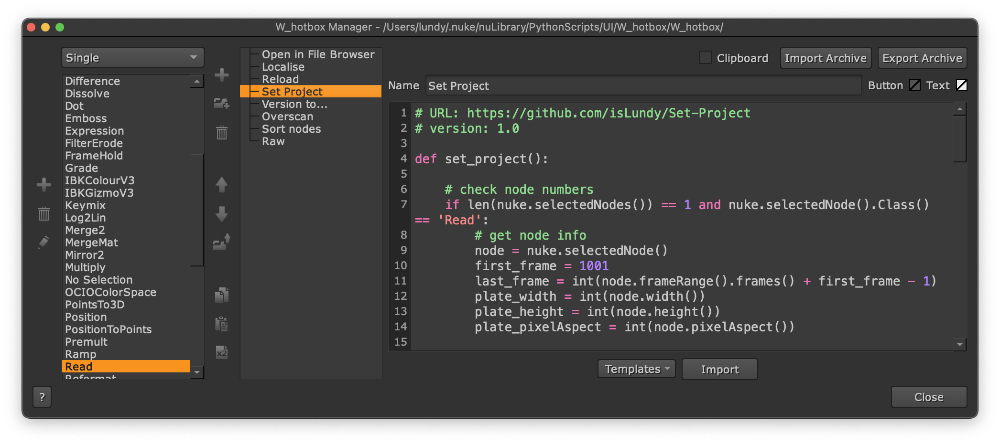
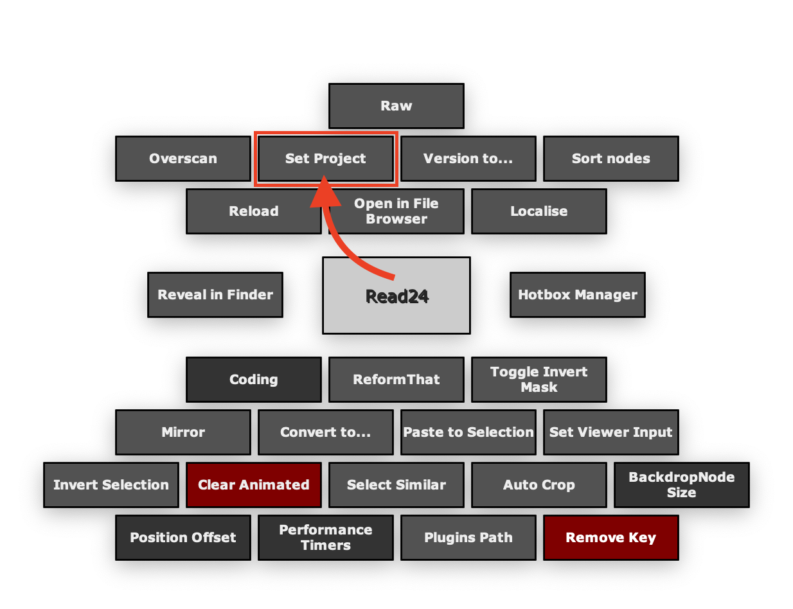

<h1 align='center'>
  Set Project
</h1>

 

## Features

Set `Project Settings` based on the selected Read node, including:

- `Frame range`

    > The default setting for the first_frame is 1001. If needed, you can change it in line `10` of the code.

- `fps`

- `full size format`

 

## Usage

Select `a` `Read` node and then run the script.

 

## Installation

Put the code into the `W_hotbox`.

